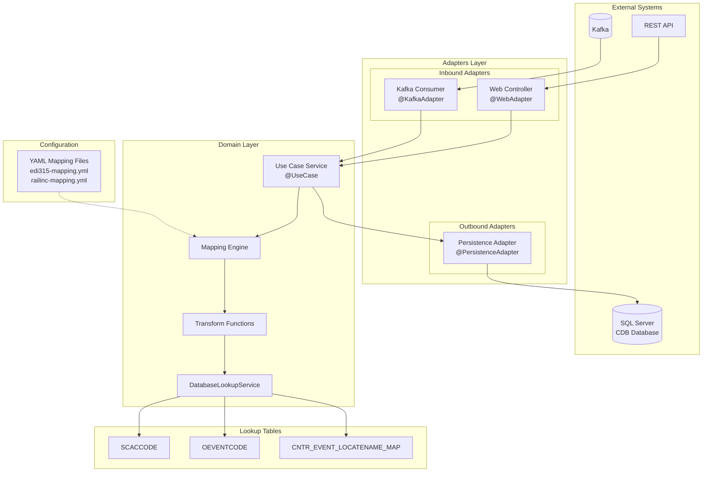
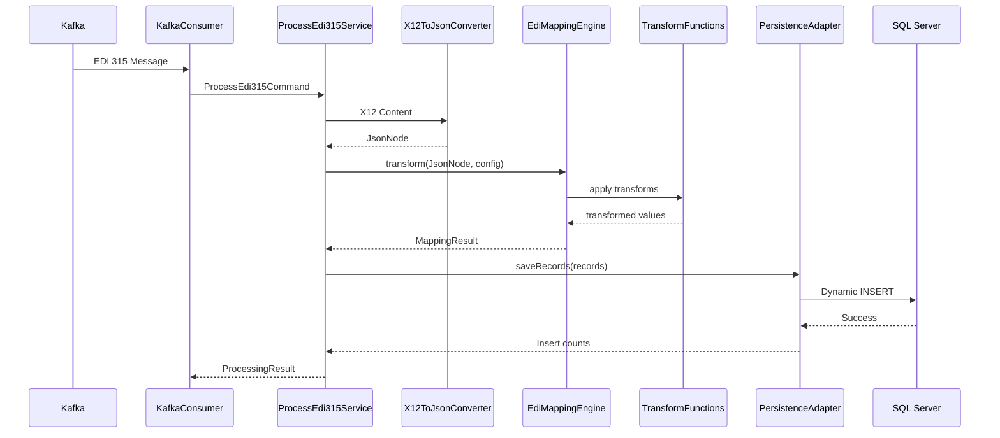
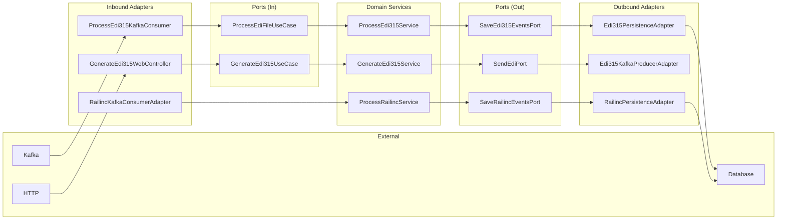
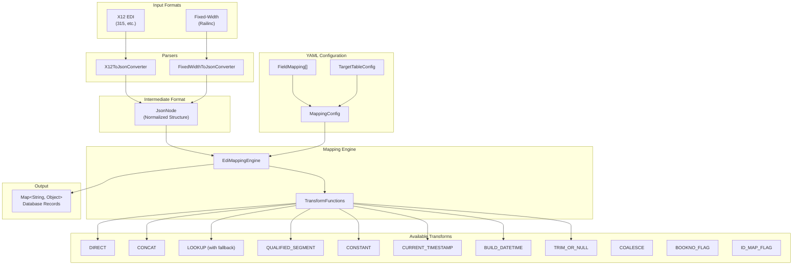
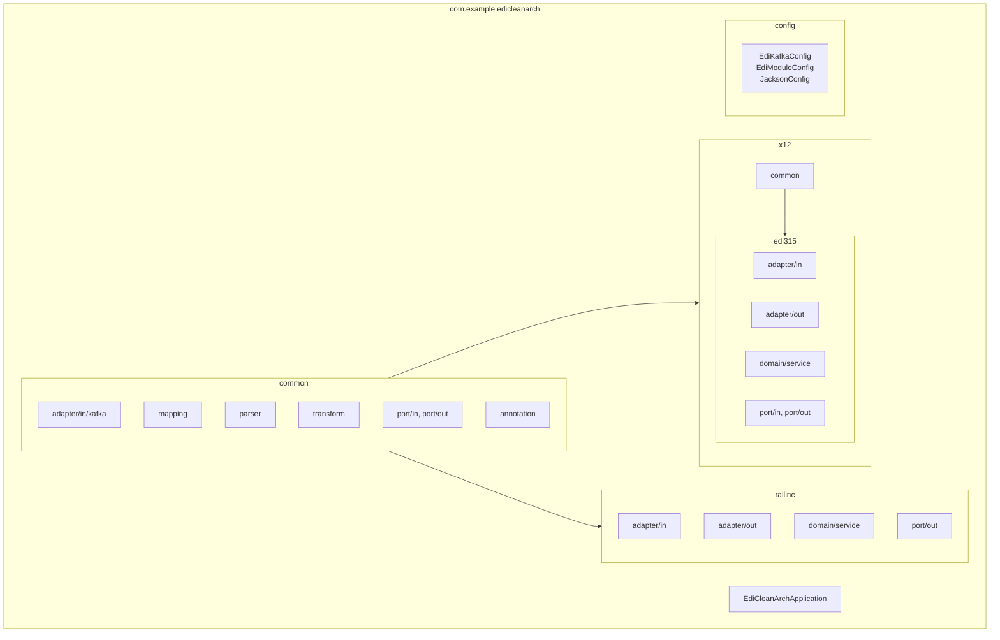
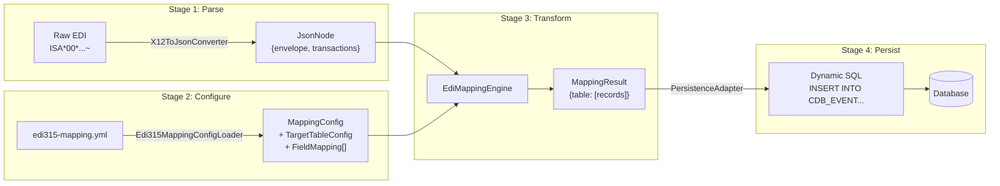
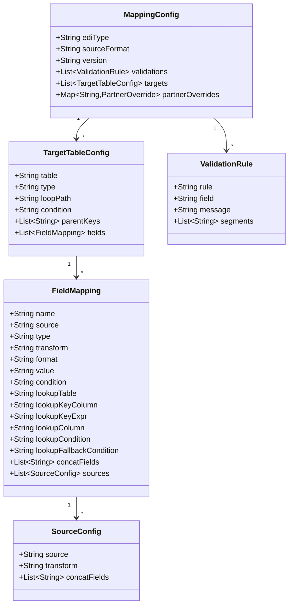

# EDI Clean Architecture System Diagrams

## 1. High-Level Architecture

## 2. EDI 315 Processing Flow

## 3. Clean Architecture Layers

## 4. Config-Driven Mapping System

## 5. Module Structure

## 6. Data Transformation Pipeline

## 7. YAML Mapping Structure

